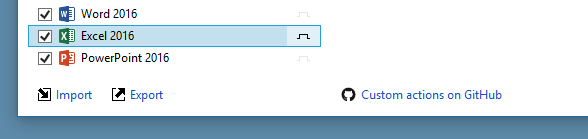
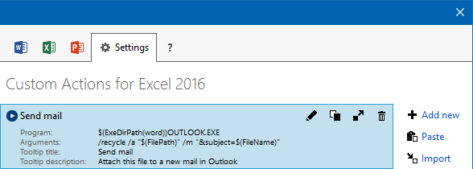
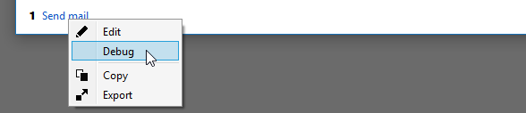
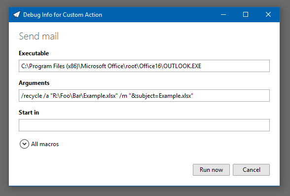

Custom Actions for Emaroo 4
=========================

A custom action for [Emaroo](https://www.roland-weigelt.de/emaroo/) calls an executable with arguments built using macros e.g. for the full path of currently selected file/directory, or just the file name, the extension, etc.

Custom actions are defined per-application. They appear as buttons below the corresponding list of most recently used (MRU) items and as entries of the  item's context menu. If you prefer hotkeys, you can also run a custom action via <kbd>Ctrl</kbd>+_number_.

(_The custom actions for Emaroo 3.x [have been moved below the `v3` folder](v3/README.md)_)

Sharing Custom Actions
---

Starting with Emaroo 4, custom actions can be shared by copying/pasting a text string that you can put on an HTML page, insert into an email, or maybe even post on Facebook ;-).

File-based import/export of individual custom actions (via `.action.json` files) is still supported and will continue to be in the future.

Ready-to-use Custom Actions
---
The custom actions are categorized by the executable that is _called_:
* [Visual Studio](actions/visualStudio.md)
* [Visual Studio Code](actions/code.md)
* [Tools related to Git](actions/git.md)
* [Applications for designers](actions/designers.md)
* [Other applications/tools](actions/misc.md)

How to Use
---
As an example, here's a custom action that creates a new mail in Outlook and adds the current file as an attachment (read how it was done in "[How to Write Your own Custom Action](WriteYourOwn.md)"):
  ```
§§²lXkT!$qXGz!!#0°PY,qSN1"%COZ:³47"O0r9S#N@)-iIT)k/3RFj-nt_*^SIUe;l(_%-:G'S[,_C,
lpZh6Mr*h^S\Z]/96DX:26]"_oqKgs0Atl_rXV\E\8AlP#7-`ZXN9N4t\h0;%UY`Y!g%k5EFr°U"1C_F
;h6,\`f0,2S4$:@K³MSO3Rif)[8a@f'a[ARTsTq?ZcgNYQAE\l6PHdDspcil"G+9sChD)lC[F:\Ql\K6
(3b,O1.HZgPSB78a5C[LV\hl:7/5!ufA\T=g76@uO2WaiLL40`V§§
```
* Select and copy the text for the custom action to the
  clipboard.
* In Emaroo, open the Settings tab (  ).
* In the "Applications" list on the, select the tool/application you want to add the custom action to:
  
* In the "Custom Actions for ..." list, click the "Paste" button (or press <kbd>Strg</kbd>+<kbd>V</kbd>) to paste the custom action.
  
* Switch back to the application's tab page and you're good to go!
* **Tip:** You can view the custom action for a specific selected file or folder before running the custom action by opening the context menu on the custom action's button and selecting "Debug":
  
* In the debug dialog you'll see the actual command line to be used (and you can inspect the values of all macros):
  

  Want to Write Your Own?
  ---
  Take a look at "[How to Write Your own Custom Action](WriteYourOwn.md)"!